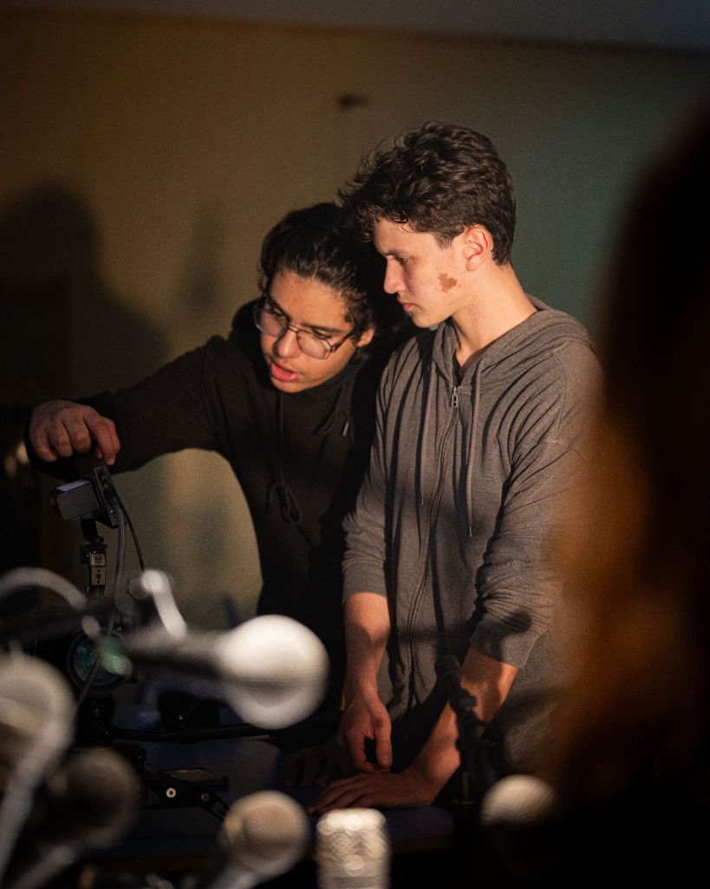

# Oussama Mazroui -— Creative Producer & Digital Strategist

<div align="center">



### **Cinematic Storytelling × Performance Media × High-Value Digital Systems**

[](https://github.com/youssefessediqtaj/OussamaPortfolio)
[](https://react.dev/)
[](https://www.typescriptlang.org/)
[](https://tailwindcss.com/)
[](https://greensock.com/gsap/)
[](./src/locales/translations.ts)

[View Live Demo](http://localhost:5173/) • [Direct Contact](#-direct-contact--inquiries) • [Project Highlights](#-featured-works--film-archive)

---

</div>

## 📌 Executive Overview

**Oussama Mazroui** is a **Creative Producer & Digital Strategist** based in Casablanca, Morocco, operating internationally. 

This digital portfolio is engineered from the ground up as a bespoke cinematic experience — bridging the gap between high-end editorial film production and quantifiable commercial ROI.

### Core Disciplines:
- **Cinematic Production & Creative Direction**: Narrative brand films, commercials, music videos, and editorial storytelling.
- **Data-Driven Media Buying**: Connecting high-production visual assets with targeted digital acquisition and conversion funnels.
- **Content Architecture & Subscription Models**: Designing scalable recurring video pipelines that drive long-term business equity.

---

## ✨ Key Features & Technical Highlights

### 🌐 1. Full-Website Bilingual Engine (`FR / EN`)
- **Instant Reactive Switching**: Complete translation across 100% of website content (Navbar, Hero, Bio, Project Case Studies, Experience Timeline, Capabilities, Process, and Modals).
- **Persistent State**: User language preference is automatically stored in `localStorage`.
- **Zero Layout Shifts**: Fluid typographic adaptation between English and French.

### 🎬 2. Cinema Stage & Interactive Video Player
- **Master Showreel 2023–2026**: High-definition video player optimized with fast-start streaming.
- **Multi-Source Support**: Native HTML5 H.264 video streams alongside responsive YouTube/Vimeo embeds.
- **Film Frame Overlays**: Aspect ratio markers (16:9, 2.39:1 anamorphic scope, 9:16 vertical reels) with real-time video preview on hover.

### 🎞️ 3. Horizontal Film Reel & Custom Motion
- **GSAP ScrollTrigger Scrubbing**: Interactive horizontal timeline reel on desktop.
- **Film Strip Ruler**: Fixed left-side interactive 24FPS frame counter and scroll gauge.
- **Custom Magnetic Lerp Cursor**: Adaptive cursor states (`PLAY`, `VIEW`, `CLOSE`, `POINTER`).
- **Lenis Smooth Scroll**: Inertia-based momentum scrolling for fluid browsing.

### 💬 4. WhatsApp Business Ecosystem & Direct Inquiries
- **Interactive Floating WhatsApp Drawer**: 4 auto-generated inquiry presets (*Commercial Production, Content Strategy, Post-Production, Quick Chat*).
- **Contact Inquiry Desk**: Multi-select project type pills, budget range selector, and clipboard copy shortcuts.

---

## 📽️ Featured Works & Film Archive

| # | Project | Role | Category | Format / Link |
|---|---|---|---|---|
| **01** | **CAPTEUR VISIONS** | Creative Producer & Director | Film / Commercial | 16:9 4K Video |
| **02** | **NOCTURNE** | Video Editor & Colorist | Editorial / Fashion | 2.39:1 Anamorphic Scope |
| **03** | **ATELIER CASABLANCA** | Creative Producer & Strategist | Documentary / Brand | 9:16 Vertical Reel |
| **04** | **HORIZON PROTOCOL** | Creative Producer | Commercial / Campaign | Wide-format 16:9 |
| **05** | **ITTAR** | Co-Director | Film / Fiction | [Watch on YouTube](https://www.youtube.com/watch?v=EQqEEuDpzfg) |
| **06** | **DUA** | 1st Assistant Camera (1st AC) | Music Video / Production | [Watch on YouTube](https://www.youtube.com/watch?v=EBjakBI-khQ) |

---

## 🛠️ Technology Stack

- **Framework**: [React 18](https://react.dev/) + [TypeScript](https://www.typescriptlang.org/)
- **Bundler & Dev Server**: [Vite 6](https://vitejs.dev/)
- **Styling**: [Tailwind CSS 3.4](https://tailwindcss.com/) + PostCSS + CSS Variables
- **Animations & Motion**:
  - [GSAP (GreenSock)](https://greensock.com/gsap/) for timelines, scrub triggers, and clip-path reveals
  - [@studio-freight/lenis](https://github.com/darkroomengineering/lenis) for smooth inertia scrolling
- **Iconography**: [Lucide React](https://lucide.dev/)
- **Internationalization**: Custom lightweight reactive React Context (`LanguageContext`)

---

## 📂 Project Structure

```bash
oussama-portfolio/
├── public/
│   ├── favicon.svg             # Custom monogram favicon
│   ├── images/                 # Stills, thumbnails, and posters
│   │   ├── ittar-thumbnail.jpeg
│   │   ├── Dua-thumbnail.jpeg
│   │   ├── on-set-directing.jpg
│   │   └── ...
│   └── videos/                 # Transcoded showcase & showreel videos
│       ├── showreel.mp4
│       ├── project-01.mp4
│       └── ...
├── src/
│   ├── components/
│   │   ├── about/              # Bio, pillars, director statement
│   │   ├── capabilities/       # 8 Full-stack production disciplines
│   │   ├── common/             # Cursor, FilmRuler, Modals, WhatsApp widget
│   │   ├── contact/            # Inquiry form, desk, WhatsApp presets
│   │   ├── experience/         # Career chronology & agency leadership
│   │   ├── footer/             # Social links, direct line, copyright
│   │   ├── hero/               # Typographic intro, role badges, video stage
│   │   ├── manifesto/          # Kinetic typography & agency philosophy
│   │   ├── process/            # 4-stage production framework
│   │   ├── showreel/           # Cinematic showreel section & specs
│   │   └── work/               # Selected work grid, horizontal reel, modals
│   ├── context/
│   │   ├── CursorContext.tsx   # Custom cursor provider
│   │   └── LanguageContext.tsx # Bilingual i18n switcher context
│   ├── data/                   # Bilingual datasets (projects, services, etc.)
│   ├── hooks/                  # useLenis, useMediaQuery, useReducedMotion
│   ├── locales/                # Master EN / FR dictionaries (translations.ts)
│   ├── types/                  # TypeScript interface contracts
│   ├── utils/                  # GSAP & video utility helpers
│   ├── App.tsx                 # Root application wrapper
│   ├── index.css               # Film grain overlays & typography setup
│   └── main.tsx                # React DOM entry point
├── package.json
├── tailwind.config.js
└── vite.config.ts
```

---

## ⚡ Getting Started Locally

### Prerequisites
- **Node.js**: `>= 18.0.0`
- **npm**: `>= 9.0.0` (or pnpm / yarn)

### Installation

1. **Clone the repository:**
   ```bash
   git clone https://github.com/youssefessediqtaj/OussamaPortfolio.git
   cd OussamaPortfolio
   ```

2. **Install dependencies:**
   ```bash
   npm install
   ```

3. **Start the local development server:**
   ```bash
   npm run dev
   ```

4. Open your browser and navigate to:
   ```
   http://localhost:5173/
   ```

5. **Build for production:**
   ```bash
   npm run build
   ```

6. **Preview the production build:**
   ```bash
   npm run preview
   ```

---

## 🚀 Deployment

This project is fully static and optimized for zero-configuration deployment on leading cloud platforms:

### Deploy with Vercel:
```bash
npx vercel
```

### Deploy with Netlify:
```bash
npx netlify deploy --prod
```

---

## 📬 Direct Contact & Inquiries

- **Creative Producer**: Oussama Mazroui
- **Email**: [oussamamazroui49@gmail.com](mailto:oussamamazroui49@gmail.com)
- **Direct Phone / WhatsApp**: [`+212 653 636 981`](https://wa.me/212653636981)
- **Location**: Casablanca, Morocco *(Available for worldwide productions & remote collaborations)*
- **LinkedIn**: [linkedin.com/in/oussama-mazroui](https://www.linkedin.com/in/oussama-mazroui/)

---

<div align="center">

<sub>Designed & Engineered with Cinematic Precision. © 2026 Oussama Mazroui. All rights reserved.</sub>

</div>
